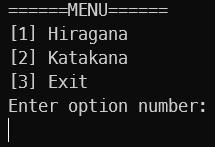

# Hiragana and Katakana Learn
## Description
A console program to help you learn [Hiragana](https://en.wikipedia.org/wiki/Hiragana "Article about Hiragana") gojuuon and [Hiragana](https://en.wikipedia.org/wiki/Katakana "Article about Katakana") gojuuon.

## Backend
Python 3.11.5

## Instruction
After stating the program, a menu with options is displayed

- Enter option `1` to proceed to the Hiragana gojuuon test.
- Enter option `2` to proceed to the Katakana gojuuon test.
- Enter option `3` to proceed to exit the program.

*The next instruction is the same for Hiragana and Katakana.*

After entering option `1` or option `2`, a syllable is displayed with sample answers.

If you enter the correct answer, it will display a message about the good answer and ask you to continue.
Otherwise, an incorrect answer message will be displayed. 