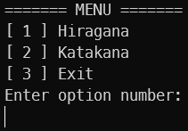
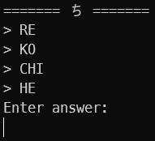
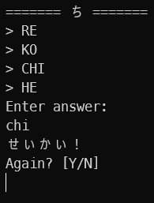
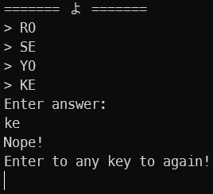

# Hiragana and Katakana Learn

A console program to help you learn [Hiragana](https://en.wikipedia.org/wiki/Hiragana "Article about Hiragana") gojuuon
and [Hiragana](https://en.wikipedia.org/wiki/Katakana "Article about Katakana") gojuuon.

## Table of contents

* [Technologies Used](#technologies-used)
* [Instruction](#instruction)
* [Project Status](#project-status)
* [Licence](#licence)

## Technologies Used

- Python 3.13.2
- PyTest 8.3.5

## Setup
To set up the project, follow these steps:

1. Install the necessary dependencies:
    - [Docker](https://docs.docker.com/engine/install/)
    - [Git](https://git-scm.com/downloads)

2. Clone the repository:
   ```bash
   git clone https://github.com/lukaskierzek/Hiragana-Katakana-Learn-Python.git
   ```
   
3. Change directory to Hiragana-Katakana-Learn-Python:
   ```bash
   cd HiraganaKatakana-Katakana-Learn-Python
   ```

4. Build and run the application using Docker:
   ```bash
   docker compose up --build
   ```
   
5. Run a command:
   ```bash
   docker compose up -d &&
   docker exec -it hiraganakatakana_app python Program.py &&
   docker compose stop
   ```

## Instruction

After stating the program, a menu with options is displayed



- Enter option `1` to proceed to the Hiragana gojuuon test.
- Enter option `2` to proceed to the Katakana gojuuon test.
- Enter option `3` to proceed to exit the program.

*The next instruction is the same for Hiragana and Katakana.*

After entering option `1` or option `2`, a syllable is displayed with sample answers.



If you enter the correct answer, it will display a message about the good answer and ask you to continue.



- Pressing `Y` or `y` will display new syllable with samlpe answers.
- Pressing `N` or `n` to proceed to the menu.

Otherwise, an incorrect answer message will be displayed.



Pressing any key to again will redisplay the same syllable with sample answers.

## Project Status

Completed

## Licence

> [Full content of the licence](LICENCE).

MIT